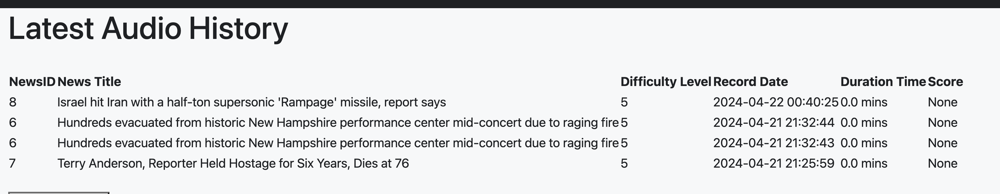

# Summary
This web app integrates audio collection function to the current patient profile.

It connects to sandbox FHIR servers (or any other FHIR server) via OAuth, and get the patient profiles. The current app could also Patients within the FHIR servers could register to our local server. After that, they could start their task by reading a paragraph of google news and upload their audio files. Our local server then collect their audio task information. At the local site, we have python sqlite database to save the News, UserModel, AudioTask tables.

# Instructions to Run
## Install required packages
All codes are in the code directory. To run it, we need the python (>= 3.10) packages in requirements.txt
```
fhirclient==3.2.0
Flask_SQLAlchemy
Werkzeug
WTForms
SQLAlchemy
Flask_WTF
Flask_Login
alembic
Flask_Migrate
Flask
uwsgi-plugin-python3
uwsgi
email_validator
pandas
PyYAML
numpy
newspaper3k
gnews
lxml_html_clean
python-dotenv
pymongo

```
To install these packages:
```
pip install -r requirements.txt
```

## Initiate flask_migrate of database
We used python sqlite database, and create 3 data tables to save the patient, news, and audio file information. To start, we could first run flask db (If database.sqlite is available, you could also ignore this part):
```
rm -rf migrations
rm application/database.sqlite
flask db init
flask db migrate -m 'first migration'
flask db upgrade
```

## Run app
In the code directory
```
python app.py
```
go to [127.0.0.1:5000](127.0.0.1:5000), and we will be in the welcome page like this


login page like this: 

After login, we could go to audio collection:


we could check the audio files before submitting:


We could check the new uploaded audio information:


The audio files are saved in the code/application/audiofiles


We could also check the Appoints, Medications etc. Not shown explicitly here.

## Database structure
I have 3 data table, shown in the models.py below. These 3 tables save local patient, newsFile, and audioTask information. It's a simple relation database.


```python

class UserModel(db.Model, UserMixin):

    __tablename__ = 'users'

    # can't change to user_id, it will crash the UserMixin
    id = db.Column(db.Integer, primary_key=True)
    given_name = db.Column(db.String(64))
    family_name = db.Column(db.String(64), nullable=True)
    date_of_birth = db.Column(db.Date, nullable=True)
    identifier_system = db.Column(db.String(), nullable=True)
    identifier_value = db.Column(db.String(64), nullable=True)
    oauth_server = db.Column(db.String(64), default='smart',nullable=True)
    patient_id = db.Column(db.Integer,unique=True,nullable=True, index=True, name='idx_patient_id')
    email = db.Column(db.String(64), unique=True, nullable=True, index=True, name='idx_user_email')
    password_hash = db.Column(db.String(256), nullable=True)

class News(db.Model):
    __tablename__ = 'news'
    id = db.Column(db.Integer, primary_key=True)
    title = db.Column(db.String(80), nullable=False)
    body = db.Column(db.Text, nullable=False)
    pub_date = db.Column(db.DateTime, nullable=False,
                         default=datetime.utcnow)
    length = db.Column(db.Integer, nullable=False)
    hashtags = db.Column(db.Integer, nullable=False)
    level = db.Column(db.Integer, default=5, nullable=False)

class AudioRecord(db.Model):
    __tablename__ = 'audio_records'
    
    id = db.Column(db.Integer, primary_key=True)
    patient_id = db.Column(db.Integer, db.ForeignKey('users.id', name='fk_audio_record_user_id'), nullable=False)
    news_id = db.Column(db.Integer, db.ForeignKey('news.id', name='fk_audio_record_news_id'), nullable=False)
    record_date = db.Column(db.DateTime, nullable=False, default=datetime.utcnow)
    file_dir = db.Column(db.String(255), nullable=False)
    duration = db.Column(db.Float, nullable=True)
    score = db.Column(db.Integer)
    patient = db.relationship('UserModel', backref=db.backref('audio_records', lazy='dynamic'))
    news = db.relationship('News', backref=db.backref('audio_records', lazy='dynamic'))

```

# FHIR server config
I tested a lot of FHIR server online, and they are not all good to run my code. Currently, I tried:
```python
api_base='http://hapi.fhir.org/baseDstu3/'
```
you could also try other FHIR servers. This parameters is configed at application/fhir/server_config.yml. Only patient within the FHIR server could register in the app. When a new patient register, we search their information on FHIR server through FHIRclient, then register in the local users table. He could login in with email and passwords later, and get the other FHIR information including appoints and medication histories.

I also have a news table, which store the daily news with a news.id and other characters. When a patient is doing a audio task, a random news is fetched from database, and present to him. He began to record. After finished, he could play it and decide whether to upload or not. The uploaded files are saved, and other qualities including news.id, patient.id, duration, etc are saved in the audio_records table.

Some code is modified from https://github.com/kelhwh/fhir-flask-client-web-app, which built a basic framework.

## overall structure diagram


## Reference:
1. fhirclient, https://pypi.org/project/fhirclient/
2. SMART on FHIR, https://github.com/smart-on-fhir
3. SMART on FHIR python client demo
, https://github.com/pete88b/smart-on-fhir-client-py-demo
4. fhir-flask-client-web-app,https://github.com/kelhwh/fhir-flask-client-web-app
5. SMART Launcher,https://launch.smarthealthit.org/
6. App Launch: Scopes and Launch Context,https://www.hl7.org/fhir/smart-app-launch/scopes-and-launch-context.html
7. Flask’s documentation, https://flask.palletsprojects.com/en/3.0.x/